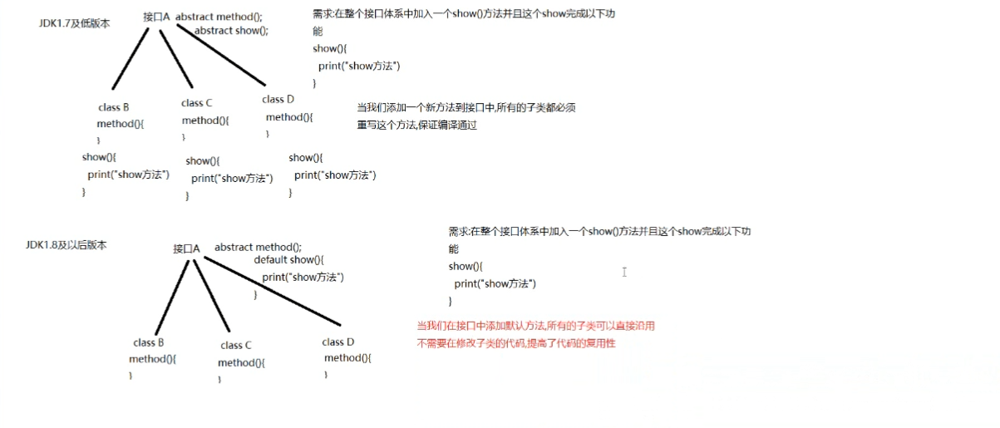
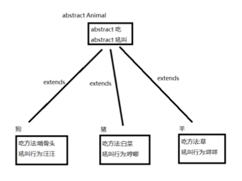
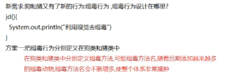
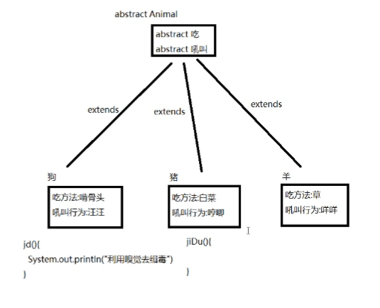
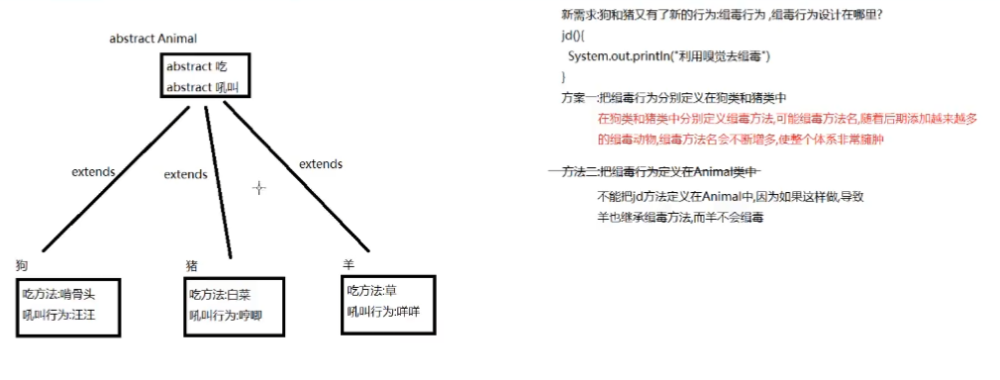
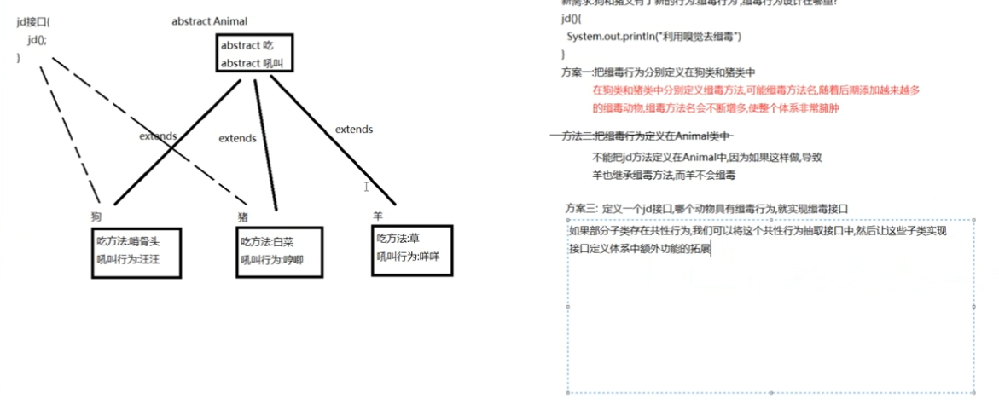
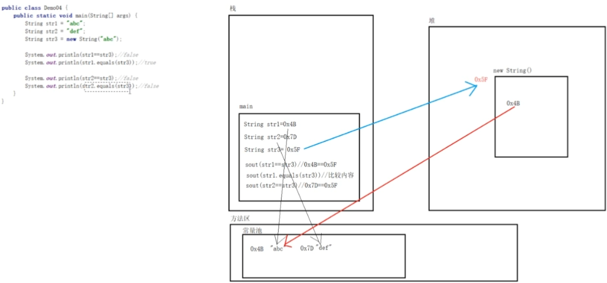
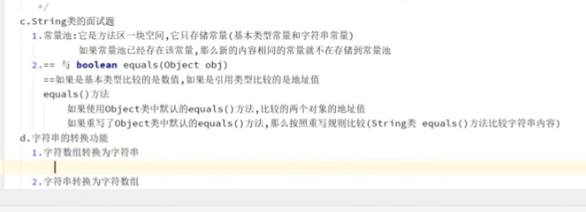
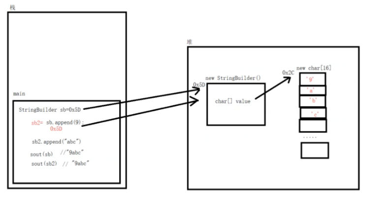
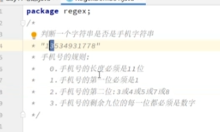

### 固定开头
`public static void main(String[] args){`

### 转义字符
- \t 制表符 实现对齐
- \n 换行符
-  \ \  一个\
-  \" 一个"
-  \' 一个'
-  \r 一个回车


### 注释
// 单行注释
/*
多
行
注
释
*/

### 文档注释
/**
*name
*version
*/

### 数据类型
#### 基本
- 整数 byte[1] shor[2] int[4] long[8]
- 浮点 float[4] double[8]
- 字符 char[2]
- 布尔 boolean[1] //true false
##### 引用
- 类 class
- 接口 interface
- 数组 []

##### 转换
- byte short char三者不能互相转换
- 三者进行运算 自动转换int

### 算术运算符
% 取余  11%9     2
++ 前 先运算后取值
++ 后 先取值后运算
int k=++j 先 j=j+1 后 k=j
-- 前 先运算后取值
-- 后 先取值后运算
int i=1
i=++i 1  

int i=1
i=i++ 2

10/4  2
10.0/4  2.5
double d=10/4 2.0
a % b =a - a / b * b
10%3  1
-10%3 -1
10%-3 1


### 关系运算符
== 判断相等于 输出true false
boolean

### 逻辑运算符
a&b 逻辑与 同为真 则真 否则假
a&&b 与上相同
区别
a&&b  a为false b不再执行判断
a&b   a为false 判断执行
int a=4
int b=9
if(a<10 && ++b<50>)  b执行 b=b+1
print(a=4 b=10)
开发中 &&使用较高

a|b 逻辑或 有真 ture
a||b 短路或 同上
区别
a||b a为true b不再判断执行
a|b  a为true b会判断执行
int a=4
int b=9
if(a<10 || ++b<50>)  b执行 b=b+1
print(a=4 b=10)
开发中 ||使用较高

!^
(10>5) true
!(10>5) false

a^b  逻辑异或  a T b F or a F b T 为true 

### 赋值运算符
a+=b  a=a+b
a-=b  a=a-b

### 三元运算符
条件表达式？表达式1:表达式2；
表达式true 输出表达式1结果
表达式false 输出表达式2的结果
例子
```
int a = 10；
int b = 99；
int result = a > b ? a++ : b--;
```
### 进制转换
2转10
模2除 取余 由下到上
10转8
模8除 取余 由下到上


### java扫描器
```
import java.util.Scanner;
Scanner scannername = new Scanner(System.in);
```
### 字符串比较
`String.equals(Stringname)`

### 分支
```
if else
switch key{
case  123：
xxx
break；
}
```
### 类与对象
(对象[属性,
    行为])
class 类名{
    
}

### 封装
- 属性私有化           | private 数据类型 变量名
- 提供公共方法set方法  | public void set变量名(数据类型 参数名)
- 提供公共get方法      | public void get变量名()

### 继承
解决代码复用性
public class child extends father
#### super()
默认调用父类构造器
根据参数个数选择父类构造器

### 重写（覆盖）
子类同方法覆盖父类同方法

### 多态
方法的多态（重写和重载）

对象的多态
- 编译类型和运行类型可以不一样
- 编译类型在定义对象时确定 不能更改
- 运行类型可以变化
- = 左边 编译类型  = 右边 运行类型
Animal animal   =   new Dog();
编译类型 Animal    运行类型 Dog
animal = new cat()
运行类型从dog -> cat

#### 编译类型 运行类型
属性
属性没用重写
属性的值看编译类型

方法
表面编译类型 实际运行类型
```
animal{
    animalcry
}
dog{
    dogcry
}

- Animal animal = new dog();
animal.cry()  // dogcry

- ainmal animal = new animal();
animal.cry() // animalcry
```
#### 向上转型
感觉是继承的默认
Animal animal = new dog()
父类类型 引用名 = new 子类类型() // 本类——>父类
javac       ——>     java
能调用父类所有成员（遵守访问类型）
不能用子类特有成员

#### 向下转型
子类类型 引用名 = new 子类类型()
父类调用子类方法
```
- animal{}
cat extends animal{
    catchmouse()
}
animal{
cat cat = (cat) animal；
cat.catch animal
}
```
#### instanceof
```
class A{}
class B extends A{}
判断对象的运行类型是否为某类型或者某类型的子类型
main{
    B b = new B()
    b的运行类型（B）是否为B运行类型
    b instanceof B //true
    b的运行类型（B）是否为A运行类型的子类型
    b instanceof A //true
}
```
#### **动态绑定机制**
调用对象方法与对象运行类型绑定
调用对象属性 没用绑定机制 看编译类型
```
Animal animal   =   new Dog();
编译类型 Animal 引用名 animal = new 运行类型 Dog
class A{
    a = 1
}
class B extends A{
    a = 2
    b(){
        return a
    }
}

main{
    B b= new A() 
    b.b() // 属性无绑定 看编译类型 A {a = 1} ->B {return a}
}
```


### == 与 equals 
== 比较运算符
判断基本类型的值是否相等 `int a = 10, double b = 10.0, a == b;`
判断引用类型的物理地址是否相等 
equals 是object类中的方法 只能判断引用类型
String（判断字符串相等不） 和 Integer判断里面的数值是否相等 会重写equals
    a.Integer（1）.epuals(b.Integer(1)) //ture
    a.name.equals(p2.name) // ture


### hashCode()
哈希值 同一个对象哈希值相同 每一个不同对象都有不同哈希值（10进制）
```
AA aa1 = new AA();
AA aa2 = new AA();
AA aa3 = aa1;
aa1.hashcode() != aa2.hashcode();
aa1.hashcode() = aa3.hashcode(); 
```
### toString()
```
main(){
    System.out.println(A.toString()+monster.hashCode());
    // 输出 A类所在的包和A的类名A和16进制的哈希码 + 10进制哈希码
    System.out.println(A)
    // 输出A类所在的包和A的类名A和16进制的哈希码
}
class A{
    name
    id
}
```
对toString()重写  输出你想返回的属性
```
public String toString(){
    return "A{"+"name="+name+"id="+id+"}";
}
```
### finalize()
垃圾回收时自动调用finalize()
对象没有任何引用 垃圾回收器会回收对象

    main(){
        Car car = new Car();
        car = null;     //car对象没有任何引用 垃圾回收器会回收对象 回收finalize()
    }
    class Car{
        name    
    }

重写finalize
```
@override
    public void finalize() throws Throwable {
        System.out.print("这不是默认finalize()方法")
    }
    System.gc();    //主动调用垃圾回收器
    // 输出 这不是默认finalize()方法
```


### date
    date = new date();
    simpledate sd = new simpledate("yyyy-mm-dd")

### 访问修饰符
|         | 本类  | 同包  | 子类  | 不同包 |
| :-----: | :---: | :---: | :---: | :----: |
| public  |   ✔   |   ✔   |   ✔   |   ✔    |
| protect |   ✔   |   ✔   |   ✔   |        |
| default |   ✔   |   ✔   |       |        |
| private |   ✔   |       |       |        |
>default 子类与本类在同包之内可以访问 不同包不能够访问

### 分层模式
view 界面
service 业务层
domain 数据层
utility 工具类
App main(){程序入口

1. 先准备在utils类里写需要的工具类  
>后续可以继续往里加入工具类
2. 明确功能->思路分析—>代码实现
   1. 先实现界面菜单menu
      1. mainmenu方法显示界面
      2. 在app.java 调用mainmenu方法
      3. listhouse方法显示房屋列表界面
      4. 
### static 
static本类中所有对象共享（访问时得到同一个值，修改时 修改的同一个变量）。

jkd8以及之前 static放在方法区中的静态域 jdk8以后放在堆中(class对象) 
类变量是类加载时生成类的class对象。没有创建对象实列也可以访问。
```
main(){
    // 两种方式访问
    // 类名.类变量名
    A.name1; // a  recommend;
    A.name2; // err!
    A.name3; // err!
    // 对象名.类变量名
    A a = new A();
    a.name1; // a;
    a.name2; // b;
    a.name3; // err!
}
class A{
    public static String name1 = "a";
    private static String name3 = "c";
    // 静态变量也需要遵守访问修饰符 public——>static 会访问不到类变量
    public String name2 = "b";
    // 非静态通过对象实列访问
}
```
>静态类方法与上面类似（静态方法= 类方法）
>静态方法不能使用this. 普通方法默认隐藏this super.也一样
>静态方法 只能访问静态变量和静态方法

### main()
1. main()虚拟机调用
2. java虚拟机和main()不同类
   1. 虚拟机调用main() 访问权限必须是public
   2. 虚拟机执行main() 必须是static
3. 代码理解main() String
```
public class test {}
public static void main(String args[]){
    // 传入 arg[] 数组参数
    for(int i = 0;i < args.length;i++){
            print(arg[i])
    }
}
javac test.java &&java test a b c
// abc
```
4. mian()属于静态方法 
   1. 可以访问本类中的静态变量和静态方法
   2. 访问非静态变量和方法，需要要创建和调用对象

### 代码块
1. {}  
2. [修饰符 = static]{}
不同构造器中重复代码可以写入代码块
构造器调用时，优先调用代码块中的内容

#### 类的加载
1. 创建对象实列(new)
2. 创建子类对象实例，父类也会被加载
3. 使用类的静态成员(静态属性 静态方法)
4. 创建一个对象，在一个类调用顺序是
   1. 先父类 后子类
   2. 先调用静态代码块和静态属性初始化 多个时按照定义的顺序调用
   3. 后调用普通代码块和普通属性初始化 多个时按照定义的顺序调用
   4. 调用构造方法
```
main1(){
    A a = new A();
    //get
    //B代码块被a执行 父类优先被加载
    //A代码块被a执行
    //普通A代码块被a执行
    A b = new A();
    //普通A代码块被b执行
    println(A.a1) 
    //123
    println(a.a1) 
    // 123
    // static 代码块类加载时加载 只加载一次
    // 普通代码块 调用几次加载几次 但使用静态成员时 不会执行普通代码块
};
class A extends B{
    public static a1 = geta1();
    static {
        public static int a1 = 123;
        print(A代码块被a执行);
    }

    {
        print(普通A代码块被a执行);
    }
    public static int geta1(){
        print(geta1被执行)
        return 123;
    }
}
class B {
    static {
        print(B代码块被a执行)
    }
}
```
### 单例设计模式
类中只有一个实例
- 饿汉式 
以防万一怕你没对象用 给你创建了一个对象用
1. 构造器私有化
2. 类的内部创建静态对象
3. 向外提供公共静态方法
4. 类加载时 创建对象 可能存在资源浪费 //TODO饿汉
```
main(){
    public static void main(String args[]){
        girlfriend gf = girlfriend.getInstance();
        //构造器被调用
        // name=abc;
    }
}
class girfriend{
    private String name;
    private static girlfriend gf = new girlfriend("abc");
    private girlfriend(String name){
        print("构造器被调用");
        this.name = name;
    }
    public static girlfriend getInstance(){
        return gf;
    }
    pulic toString(){
        return "name=" + name;
    }
}
```
- 懒汉式
没有创建对象 只有你要使用对象时才会创建
1. 构造器私有化
2. 类的内部创建静态对象
3. 向外提供公共静态方法
4. 用户使用getinstance() 才返回cat 对象，后续调用 依旧是cat对象 可能存在线程安全 //TODO懒汉式
main(){
    public static void main(String args[]){
        
    }
}
class girfriend{
    private String name;
    private static girlfriend gf = new girlfriend();
    private girlfriend(String name){
        print("构造器被调用");
        this.name = name;
    }
    public static girlfriend getInstance(){
        if(gf == null){
            girlfriend gf = new grilfriend("abc");
        }
        return gf;
    }
    pulic toString(){
        return "name=" + name;
    }
}

### final
1. 修饰类 属性 方法
   1. 类被final修饰时，不能被子类继承
   2. 属性被final修饰时，属性的值不能被修改
   3. 方法被final修饰时，不能被子类覆盖/重写
   4. 局部变量被final修饰时，不能被修改
2. final修饰的属性叫常量 用final double TAX_RATE = 0.08;
3. 如果final修饰的属性是static的，只能在 定义 static代码块 中赋值
4. final类不能被继承，但是可以实例化
5. final方法不能重写 但是可以被继承 可实例化使用
6. 类已经是final类，里面的方法不需要用final修饰了，因为final类不能被继承，方法不能被子类重写
7. final不能修饰构造器
8. final和static搭配使用 效率更高 影响类的加载 
```
main(){
    print(A.a);
    // 1
    A类的静态初始化没有被加载！
}
class A{
    public final static int a = 1;
    static{
        print("A类被加载")
    }
}
```
### 抽象类abstract
没有实现的方法 没有方法体{}
```
abstract class classname(){  // 有抽象方法的类 要用abstract修饰 
public abstract void meth(); // 抽象方法
}
```
1. 抽象不能被实例化
2. 抽象类不一定要有 abstract方法
3. 一旦有抽象方法 包含该抽象方法的类一定要声明为抽象类
4. 只能修饰类和方法
5. 抽象类本质还是类 可以有类的所有成员
6. 继承抽象类 要么自身是抽象类 要么实现其中的所有抽象方法。实现 = 重写父类所有抽象方法
7. 抽象方法不能被 private final static修饰 这些关键字与重写相违背。


## 接口
### 概述
接口不能实列化
引用数据类型(类，数组，接口)  
可以赋值null或者对象(在内存中存在的地址)  
接口的出现是为了弥补单继承的不足  
### 格式
public interface A{  
    成员变量  
    成员方法  
}  
public interface InterfaceBase {
    //int i; 变量没初始化 会报错
    public static final int i = 0; //public static final是接口变量的默认修饰符

class B **implements** A{  
}  
编译后 生成接口.class文件  
接口 抽象类 都不能创建对象  

### 成员变量--
public interface InterfaceBase {  
    int i; 变量没初始化 会报错  
    public static final int i = 0;  
    //public static final是接口变量的默认修饰符  
### 成员方法InterfaceMeth+
1. 抽象方法  
public abstract()  
编译器默认添加(public abstract)  
void mian();  
2. 默认方法
jkd8版本(包含jdk8)以上才能定义默认方法  
defult 返回值类型 方法名

私有方法
private void methname(){  
}  
只能在本接口中使用

### 一个类实现多个接口
```
interface A1{  
}  
  
interface A2{  
}  
  
class b implements A1,A2{  
}  
//一个类 俩个接口  
```
### 继承类的同时实现多个接口
`class classname extends classname2 implements interface1,interface2..`

### 一个接口继承多个接口
`interface A3 extends A1,A2{}`

### 抽象类与类 类与接口 接口与接口的关系 为什么需要接口接口
1. 
2. 
3. 
4. 


## API
### String
``` java
public class StringTest {
    public static void main(String args[]){
        Sting str1 = "abc";
        Sting str2 = "abc";
        Sting str3 = "def";
        System.out.println(str1==str2);
        //true 比较对象内存地址
        System.out.println(str1.equals(str2));
        //true 比较string内容 equals默认比较对象内存地址 string重写了quals方法
        System.out.println(str2==str3);
        //false 对象内存地址
        System.out.println(str2.equals(str3));
        //false 比较内容
    }
}
```


### StringBuilder
一个**可变**字符序列  
StringBuilder更节省内存  
String一经初始化不可变
``` java     
    public class StringBuilderTest {
    public static void main(String args[]) {
        /*new StringBuilder*/
        StringBuilder stringBuilder = new StringBuilder();
        ;
        //容器
        System.out.println(stringBuilder);
        //
        /*new StringBuilder("")*/
        StringBuilder sb = new StringBuilder("sb");
        System.out.println(sb);
        //sb
        System.out.println(sb.toString());
        //sb StringBuild重写了toString()
        /*StringBuilder.append()*/
        stringBuilder.append(1);
        System.out.println(stringBuilder);
        // 1
        //stringBuilder.append('1','3');俩char不行
        char[] char1 = {'1', 'a'};
        stringBuilder.append(char1);
        System.out.println(stringBuilder);
        // 11a
        stringBuilder.append(false);
        // 11a false
        System.out.println(stringBuilder);

    }

}

``` 

#### String Builder存储原理
``` java
    new StringBuilder();//容器创建时 初始化一个数字 char[] value = new char[16]
    char[16] 字符超过16个后会怎么样？ 扩容思想
    /**
    *长度超过16 此时会再创建一个新的字符数组 new char[2*原始长度+2]
    *将原来的字符拷贝到新数组 
    *新添加字符到数组末尾 
    *再把新数组的地址赋值给value
    */
    .append(9); //9转化为字符'9'追加到value数字
    .append(5.7);// 5.7 转化为 '5' '.' '7'追加到'9'字符末尾
    .append("abc"); //abc转化为 'a' 'b' 'c'追加到字符'7'字符末尾
    sout(); //value vlue所有字符转化为字符串输出
```
#### append方法的返回值
**返回原容器的数组值**
``` java
    StringBuilder sb1 = new new StringBuilder();
    StringBuilder sb2 = sb1.append(9);
    sb2.append("abc");
    sout(sb1);//9abc
    sout(sb2);//9abc
```


举例 链式编程  
``` java
        StringBuilder sb = new StringBuilder();
        //sb.append(1);
        //sb.append(abc);
        sb.append(1).append(abc).append(3.14);
```

#### StringBuilder 与 +
``` java
        String str = "c"+"e"; //ce
        // 都是常量 常量池优化 编译后String str = "ce"
        String str2 = str + "f";
        System.out.println(str2);//cef
        // 有变量 会创建StringBuilder 进行拼接
        //StringBuilder sb5 = new StringBuilder();
        //sb.append(str);
        //sb.append("f");
        //String str2 = sb.toString();
        //底层执行代码 StringBuilder str2 = new StringBuilder().append(str).append("f").toString();
```
+拼接 每拼接一次都要创建一次对象  
StringBuilder 始终使用一个对象进行拼接  
所以Stringbuilder更省内存  

#### StringBuffer与StringBuilder
构造方法和成员方法使用方式相同  
StringBuffer**线程安全的可变字符序列**  
StringBuilder **线程不安全** 效率高  

### Date
日期 精确到毫秒  
构造方法    
``` java
public class DateTest {
    public static void main(String args[]){

        Date date = new Date(); //封装日期
        System.out.println(date);//Tue Sep 27 16:18:49 CST 2022


        Date date1 = new Date(3000);//Thu Jan 01 08:00:00 CST 1970+3000ms
        System.out.println(date1);//Thu Jan 01 08:00:03 CST 1970

        //getTime
        System.out.println(date.getTime());//1664267025591
        //getTime()获取的是从1970年1月1日到当前系统时间(new Date())所经过的毫秒
        //用途 获取程序执行时间
        long startTime = new Date().getTime();//new Date() - 1970.1.1 00:00:00的毫秒值
        for (int i = 0 ; i<1000000000;i++){
            i+=2;
        }
        long endTime = new Date().getTime();
        System.out.println(endTime-startTime);

        //localTime 年-月-日 JDK1.8

    }
}
```
### 正则表达式
**规则字符串**
参考 java.util.regex.Pattern
  
``` java

public class regex {
    public static void main(String args[]) {

    }
    //正常方法
    public static boolean checkPhoneNumber(String phoneNum) {
        if (phoneNum.length() != 11) {
            return false;
        } else if (phoneNum.charAt(0) != '1') {
            return false;
        } else if (!(phoneNum.charAt(1) == '3'
                || phoneNum.charAt(1) == '4'
                || phoneNum.charAt(1) == '5'
                || phoneNum.charAt(1) == '7'
                || phoneNum.charAt(1) == '8')) {
            return false;
        } else {
            char[] chars = phoneNum.toCharArray();
            for (int i = 2; i < chars.length; i++) {
                if (!(chars[i] >= '0' && chars[i] <= '9')) {
                    return false;
                }
            }
            return true;
        }
    }
    public mathces(String regex){
        String regexstr = "1[34578]\\d{9}";
        regex.matches

    }

}
```
#### split 
切割单词  
``` java
    public boolean Mathces1(String regex){
        String str = "i love java so much";
        String regexStr = " +";
        String[] splitlst = str.split(regexStr);
        for (int i = 0; i < splitlst.length; i++) {
            System.out.println(splitlst[i]);
        }
````


